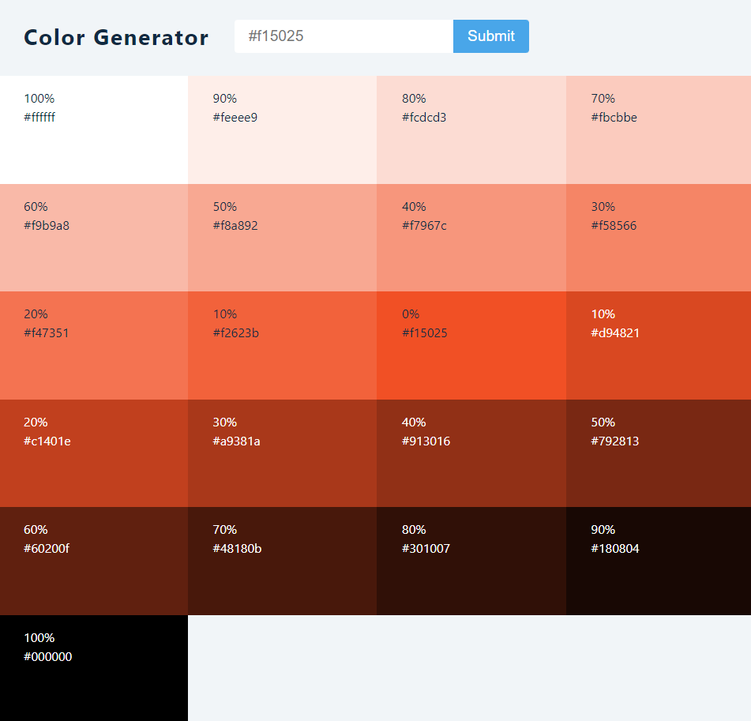

#### Colors from:

[values.js](https://github.com/noeldelgado/values.js)

## Screenshot

;

## Goal
- users should be able to type an rgb color and get other colors generated from it
- users should be able to copy colors
- setTimeout
- clearTimeout
- useEffect
- navigator.clipboard.writeText() to copy text onClick
